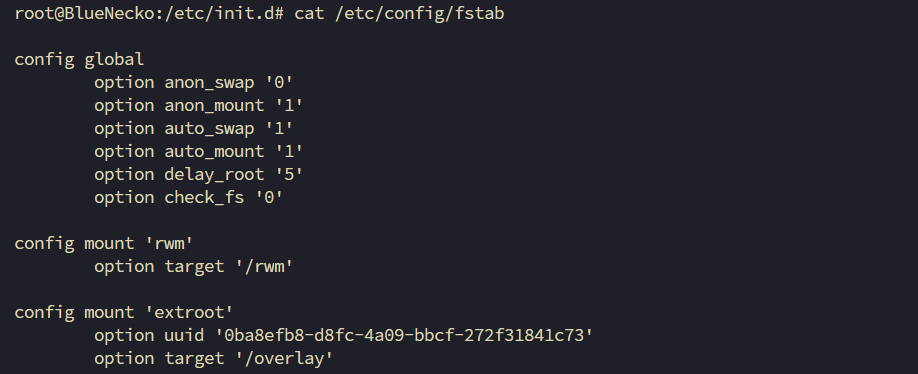

---

# Installing LuCI on JAF IDU

*Disclaimer: This is ONLY for educational purposes. No one is responsible for any type of damage. Proceed at your own risk.*

**⚠️ WARNING: Perform Step 0 first. If you accidentally fill up the storage, your only option will be to reset the router. If the installation fails midway, you will likely encounter a *500 Internal Server Error* and won’t be able to reset the router via the web UI. Your only recovery options will be the physical reset button or [Resetting the router via SSH](JAF-IDU-Reset-Via-SSH.md).**

---

## Step 0: Expand Storage

* This step is necessary because the internal storage is very limited.
* Expand the root filesystem using a USB overlay (no safer method found that doesn’t risk the router).
* Follow [this official guide](https://openwrt.org/docs/guide-user/additional-software/extroot_configuration) **carefully**.
* Reboot the device and run `df -h`. If you see your USB drive mounted at `/`, you're good to go.
* If you encounter errors, check the [Troubleshooting](#troubleshooting) section.

---

## Step 1: Clean up OPKG Feeds

* Update the OPKG feeds.
* The default OPKG feeds include many dead links used during production that now throw warnings during `opkg update`.
* To fix this, use any editor (we’ll use `vi`) to clean up the distfeeds.
* Open the file:

  ```sh
  vi /etc/opkg/distfeeds.conf
  ```
* Disable dead links and keep only valid OpenWrt ones. Below is an example for a MediaTek-based router running OpenWrt 22.02 snapshot. Modify it to match your OpenWrt version as closely as possible.

**Example of a clean distfeed:**

```sh
src/gz openwrt_base https://downloads.openwrt.org/releases/21.02-SNAPSHOT/packages/aarch64_cortex-a53/base
src/gz openwrt_luci https://downloads.openwrt.org/releases/21.02-SNAPSHOT/packages/aarch64_cortex-a53/luci
src/gz openwrt_packages https://downloads.openwrt.org/releases/21.02-SNAPSHOT/packages/aarch64_cortex-a53/packages
src/gz openwrt_routing https://downloads.openwrt.org/releases/21.02-SNAPSHOT/packages/aarch64_cortex-a53/routing
src/gz openwrt_telephony https://downloads.openwrt.org/releases/21.02-SNAPSHOT/packages/aarch64_cortex-a53/telephony
```

---

## Step 2: Uninstall Existing LuCI Components

*Note: During reinstallation, a package named `libnl-tiny2022-11-01` may cause a conflict. **DO NOT UNINSTALL IT.** The conflict arises because two packages serve similar purposes. The original package has many dependencies, so it's safer to overwrite it.*

```sh
opkg remove --force-depends \
  liblucihttp-lua \
  liblucihttp0 \
  luci \
  luci-app-firewall \
  luci-app-opkg \
  luci-base \
  luci-compat \
  luci-lib-base \
  luci-lib-ip \
  luci-lib-jsonc \
  luci-lib-nixio \
  luci-mod-admin-full \
  luci-mod-network \
  luci-mod-status \
  luci-mod-system \
  luci-proto-ipv6 \
  luci-proto-ppp \
  luci-ssl-openssl \
  luci-theme-bootstrap \
  rpcd-mod-luci
```

---

## Step 3: Reinstall LuCI

```sh
opkg update
opkg install --force-overwrite luci
```

You may receive this warning (ignore it if it doesn’t appear):

```sh
Collected errors:
 * resolve_conffiles: Existing conffile /etc/config/luci is different from the conffile in the new package. The new conffile will be placed at /etc/config/luci-opkg.
```

To resolve this:

```sh
mv /etc/config/luci-opkg /etc/config/luci
```

If successful, your `/www/` directory should contain:

```sh
cgi-bin      index.html   luci-static
```

* The default `uhttpd` server command will also launch the new LuCI interface.
* Access LuCI: [https://192.168.31.1/cgi-bin/luci/](https://192.168.31.1/cgi-bin/luci/)
* The LuCI password will be the same as your SSH password.

---

## Note

~~Many features do not work in the LuCI interface because they have used custom LuCI API endpoints or left some features unimplemented. These may or may not be fixed in the future (someone needs to invest time fixing the mess).~~

---

### Hotfix for Broken CGI API Endpoints

Fixes: System Logs, Software, Firewall, Backup/Restore/Flash pages in LuCI.

```sh
opkg update
opkg install cgi-io
```

```sh
cd /www/cgi-bin
ln -s ../../usr/libexec/cgi-io cgi-backup
ln -s ../../usr/libexec/cgi-io cgi-download
ln -s ../../usr/libexec/cgi-io cgi-exec
ln -s ../../usr/libexec/cgi-io cgi-upload
```

**Working features in LuCI:**

* Technically everything, except those controlled by OpenSync. Disabling OpenSync is possible but should be done with caution, as you will need to manually configure Wi-Fi management, DNS resolution, uplink, etc.—all of which are part of the OpenSync management layer.

---

## Bonus

* Use `btop` for a modern CLI-based resource monitor. You can compile it yourself or use the precompiled version by @pokewizardSAM.

  Link: [https://drive.google.com/drive/folders/1Om93J8oUOOn1MDMKNvqpbZeXX\_Mmn0FK?usp=sharing](https://drive.google.com/drive/folders/1Om93J8oUOOn1MDMKNvqpbZeXX_Mmn0FK?usp=sharing)

---

## Troubleshooting

If the USB overlay isn’t activating on boot, follow these steps. First, check the `dmesg` output and look for `extroot`.

### extroot-not-configured

* This usually means your configuration is invalid.
* Run:

  ```sh
  cat /etc/config/fstab
  ```
* Ensure `rwm` and `extroot` entries exist with a unique UUID and a line like:

  ```sh
  option target '/overlay'
  ```
* Example configuration:
  

### ubiblock0\_1 not found

* This error usually indicates the need to reflash the stock firmware.
* Download the firmware from: [https://small.fileditchstuff.me/s18/TGJFgrgUrrolDsBKDatu.tar.gz](https://small.fileditchstuff.me/s18/TGJFgrgUrrolDsBKDatu.tar.gz)
* Extract the archive, flash the appropriate firmware, and retry the extroot setup.


